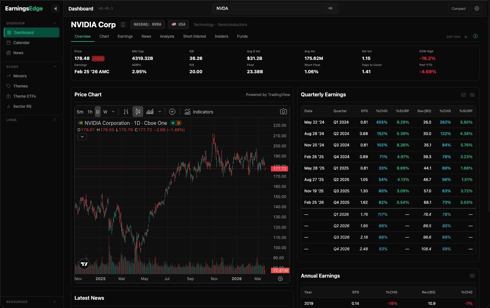

# EarningsEdge

**Earnings, analysts, insiders, short interest, and news — one dashboard.**

A free Chrome extension for Qullamaggie and Stockbee-style momentum traders. Scan pre-market gappers, research earnings surprises, and find episodic pivots — without opening ten tabs.

<a href="https://github.com/earningsedgedev/earningsedge/releases"><strong>Download Latest Release</strong></a> · <a href="https://earningsedgedev.github.io/earningsedge/">Landing Page</a> · <a href="https://ko-fi.com/earningsedge">Support on Ko-fi</a>

 

---

## Install

1. Download the latest `.zip` from [Releases](https://github.com/earningsedgedev/earningsedge/releases)
2. Unzip → `EarningsEdge-Extension` folder
3. Go to `chrome://extensions` → enable **Developer mode** → **Load unpacked** → select the folder
4. Pin it to your toolbar

Works on Chrome, Edge, Brave, and Arc.

## What's inside

**Stock dashboard** — search any US ticker for earnings history (8Q + 4 forward), earnings surprise %, analyst ratings, insider trades, short interest, institutional filings, and aggregated news. Key stats bar with ADR%, Float, Short Float, Days to Cover, Relative Volume, 52W High.

**ETF dashboard** — auto-detected. Performance across 9 timeframes, top 15 holdings, news.

**Scanners** — Movers (200 gainers/losers across pre-market, market hours, and after-hours), Stock Themes (40 themes, 268 sub-themes), Theme ETFs, Industry Relative Strength (145 industries, 5,800+ stocks).

**Earnings Calendar** — weekly view, BMO/AMC grouping, real-time price changes, confirmed actuals with surprise %.

**Extras** — command palette (`Space` / `⌘K`), hover chart preview on any ticker, chart panel split-view, keyboard shortcuts, snapshot/copy as image.

## Updating

1. Download new `.zip` from [Releases](https://github.com/earningsedgedev/earningsedge/releases)
2. Replace the folder
3. Reload on `chrome://extensions`

Settings are preserved.

## Privacy

No account required. No personal data collected. Anonymous GA4 analytics (feature usage only — no tickers, no PII). Runs entirely in your browser.

## License

See [LICENSE](LICENSE).
